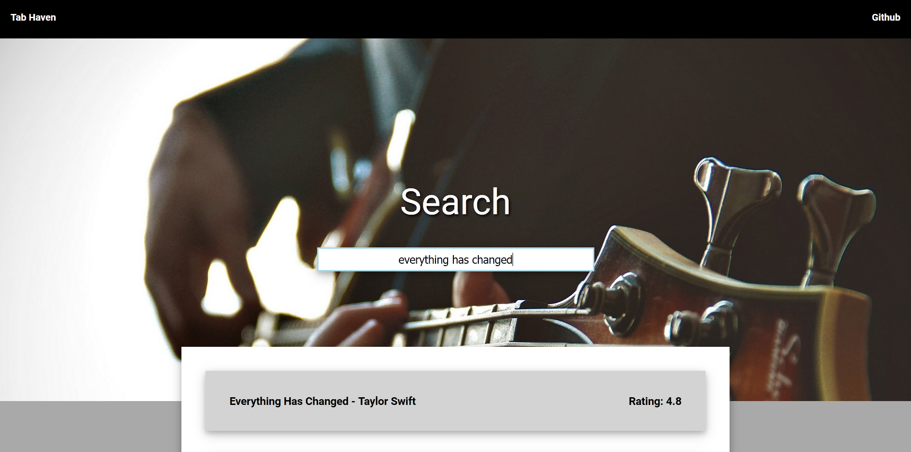
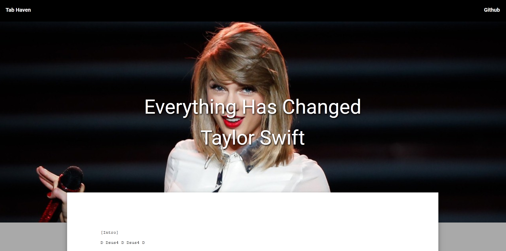

## [TabHaven](https://truongdevin.github.io/sheet-music/)

TabHaven is a frontend web application that fetches sheet music from other websites and returns them in one centralized location. It's built using React, Redux, and many Ajax requests.

## Photos

### Search

### Tab

## Future Directions for the Project
- Add support for other instruments
- Add artist bios
- Add music tuner modal
